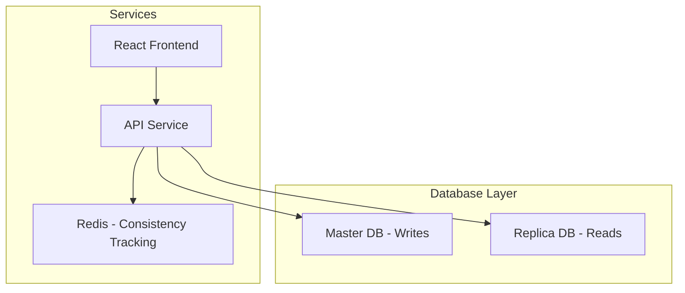

# Read Your Writes Consistency

A proof-of-concept application demonstrating read-your-writes consistency patterns in a distributed system with master-replica database architecture.

## Table of Contents

- [Overview](#overview)
- [Architecture](#architecture)
- [Components](#components)
- [Technology Stack](#technology-stack)
- [Getting Started](#getting-started)
  - [Prerequisites](#prerequisites)
  - [Running with Docker](#running-with-docker)
  - [Running Locally](#running-locally)
- [Project Structure](#project-structure)
- [Features](#features)
- [API Endpoints](#api-endpoints)
- [Database Schema](#database-schema)
- [Development](#development)
- [Contributing](#contributing)

## Overview

This project demonstrates the "read-your-writes" consistency pattern in a distributed system where data is written to a master database and read from replica databases. The challenge is ensuring that users see their own writes immediately, even when reads are served from replicas that may have propagation delays.

The application simulates this scenario with:
- A React frontend with user context switching
- .NET API with dual database contexts (master for writes, replica for reads)
- SQL Server master-replica setup
- Redis for consistency tracking

## Architecture



## Components

1. **ReadYourWritesConsistency.Web** - React frontend application
2. **ReadYourWritesConsistency.API** - .NET API service
3. **SQL Server Master** - Primary database for write operations
4. **SQL Server Replica** - Read-only replica database
5. **Redis** - Caching and consistency tracking
6. **Database Deployment** - Schema and seed data deployment

## Technology Stack

### Frontend
- React 19
- TypeScript
- Vite
- TailwindCSS
- ShadCN UI Components
- React Router v7
- TanStack Query (React Query)
- React Hook Form + Zod

### Backend
- .NET 9
- Dapper for data access
- SQL Server
- Redis
- StackExchange.Redis client

### Infrastructure
- Docker & Docker Compose
- NGINX (for web serving)
- SQL Server 2022

## Getting Started

### Prerequisites

- Docker Desktop (recommended)
- .NET 9 SDK (for local development)
- Node.js 18+ (for local development)

### Running with Docker

The easiest way to run the application is with Docker Compose:

```bash
# Clone the repository
git clone https://github.com/kaushik2901/read-your-writes-consistency.git
cd read-your-writes-consistency

# Build and start all services
docker-compose up --build

# The application will be available at:
# Web UI: http://localhost:3000
# API: http://localhost:3000/api (routed through NGINX)
```

Services will start in this order:
1. SQL Server Master Database
2. SQL Server Replica Database
3. Redis
4. Database deployment (schema + seed data)
5. API Service
6. Web Service

### Running Locally

To run each component locally:

#### Database
Start the SQL Server instances and Redis:
```bash
docker-compose up db db-replica redis
```

#### API
```bash
cd ReadYourWritesConsistency.API
dotnet run
```

#### Web
```bash
cd ReadYourWritesConsistency.Web
npm install
npm run dev
```

## Project Structure

```
ReadYourWritesConsistency/
├── docker-compose.yml          # Docker orchestration
├── Docker.md                   # Docker deployment documentation
├── ReadYourWritesConsistency.API/
│   ├── Caching/                # Redis caching implementations
│   ├── ConsistencyServices/    # Read-your-writes logic
│   ├── Endpoints/              # API endpoints (V1 and V2)
│   ├── Middlewares/            # Request processing middleware
│   ├── Models/                 # Data models
│   ├── Persistence/            # Database contexts
│   ├── Services/               # Business logic
│   ├── Program.cs              # Application entry point
│   └── ReadYourWritesConsistency.API.csproj
├── ReadYourWritesConsistency.Database/
│   └── dbo/                    # Database schema and stored procedures
├── ReadYourWritesConsistency.Web/
│   ├── src/                    # React application source
│   ├── package.json            # Frontend dependencies
│   └── Dockerfile              # Web service Docker configuration
└── tools/
    └── db-deploy/              # Database deployment utilities
```

## Features

### User Simulation
- Fixed set of users (no authentication)
- User dropdown in header to simulate different users
- All API requests are made in the context of the selected user

### Consistency Control
- Consistency behavior dropdown:
  - **None**: All API calls use V1 endpoints
  - **Read Your Writes**: All API calls use V2 endpoints
  
### Database Routing Visualization
- Shows whether current queries are served from master or replica
- Visual indication of data source for debugging

### Application Functionality
- Dashboard with project cards grid
- Project details with task management
- Full CRUD operations for projects and tasks

### Data Model
Projects contain:
- Project name
- New/Active/Blocked task counts
- Last updated date
- View button

Tasks contain:
- ID
- Name
- Status
- User name
- Last modified date

## Database Schema

The database consists of:
- **Users** table - Fixed set of users for simulation
- **Projects** table - Project information
- **Tasks** table - Task information with status
- Stored procedures for all data operations
- Seed data with realistic dummy content

Database deployment happens automatically when running with Docker.

## Development

### API Development
The API uses:
- Dapper for data access (not Entity Framework)
- Stored procedures for all database operations
- Dual database contexts:
  - `ReadWriteDbContext` for write operations (master)
  - `ReadDbContext` for read operations (replica)
- Custom middleware for consistency handling

### Frontend Development
The frontend uses:
- React with TypeScript
- ShadCN UI components
- TanStack Query for server state management
- React Router for navigation
- TailwindCSS for styling

### Consistency Implementation
The read-your-writes consistency is implemented through:
1. Redis cache to track recent writes per user
2. Middleware to detect if a request needs to be served from master
3. V2 API endpoints that enforce consistency (planned)

## Contributing

1. Fork the repository
2. Create your feature branch (`git checkout -b feature/AmazingFeature`)
3. Commit your changes (`git commit -m 'Add some AmazingFeature'`)
4. Push to the branch (`git push origin feature/AmazingFeature`)
5. Open a pull request

## License

This project is licensed for internal use and demonstration purposes.